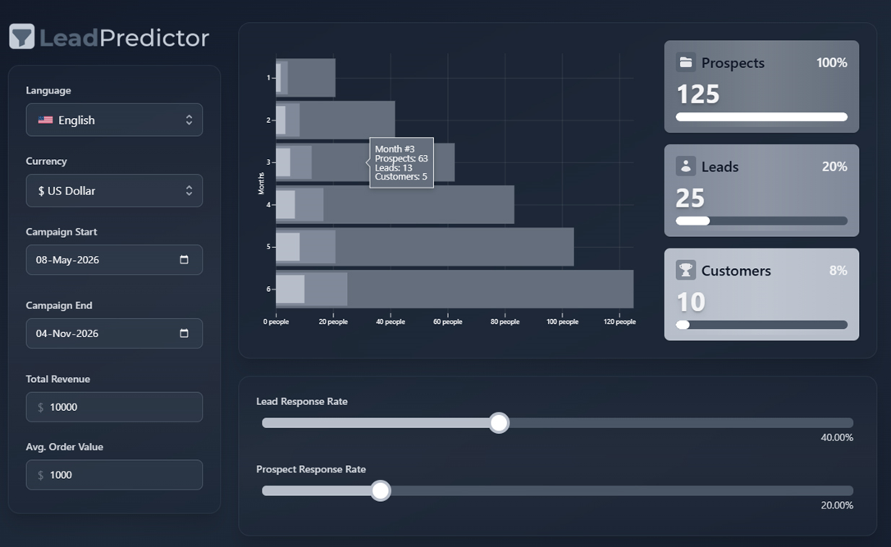

# LeadPredictor

A static web app (plain HTML, CSS and vanilla JavaScript — no frameworks, no build tools) that calculates how many prospects, leads and customers are needed to hit a target revenue, and spreads that forecast across the months of the campaign.




## Formulas

```
Customers = Total Revenue / Avg. Order Value
Leads     = Customers * 100 / Lead Response Rate%
Prospects = Leads * 100 / Prospect Response Rate%
```

The monthly chart distributes each of the three values as a linear cumulative ramp between the campaign's start and end:

```
value(month i) = total * i / N   // i = 1..N, N = number of months between Campaign Start and Campaign End
```

## Features

- Live recalculation of Prospects/Leads/Customers whenever Total Revenue, Avg. Order Value, the campaign dates, or either slider (Lead/Prospect Response Rate) changes
- Monthly bar chart with a hover tooltip showing the exact values for that month
- Language switching for labels (EN/BG/ES/DE) and currency symbol switching, with no page reload


## Running it

Open `index.html` directly in a browser — no server or dependencies required.


## Structure

- `index.html` — markup
- `css/styles.css` — styles (dark theme)
- `js/calculations.js` — pure functions for the calculations
- `js/chart.js` — renders the monthly chart
- `js/i18n.js` — label translations (EN/BG/ES/DE) and currency symbols
- `js/main.js` — wires the UI controls to the calculations
